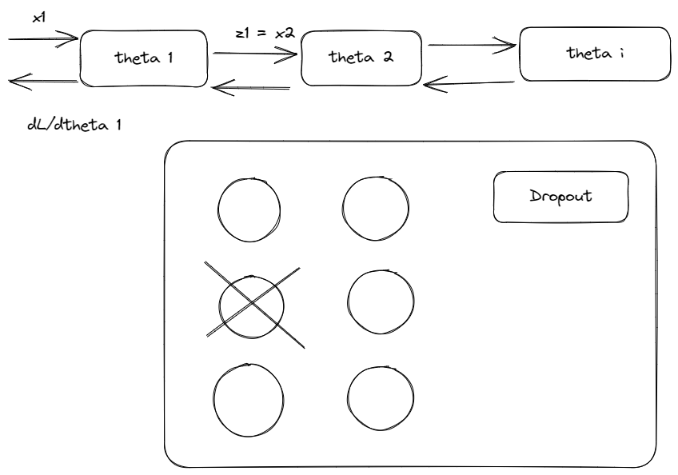

Модель нейрона:

Набор признаков у сэмпла

$X=(x_1,..x_d) \in \mathbf{R}^d$ 

Веса нейрона

$\omega = (w_1,...,w_d) \in \mathbf{R}^d$

Свободный член

$b \in \mathbf{R}$

Результат применения

$y(x) = \sigma((x,\omega)+b) = \sigma(\Sigma_{i=1}^d \omega_i x_i +b)$

$ x =(x_1,...,x_d)$

Матрица весов
$$
    \mathbf{W} = \begin{bmatrix}
    \omega_{11}       & \omega_{12} & \omega_{13} & \dots & \omega_{1H} \\
    \omega_{21}       & \omega_{22} & \omega_{23} & \dots & \omega_{2H} \\
    \dots \\
    \omega_{d1}       & \omega_{d2} & \omega_{dH} & \dots & \omega_{dn}
\end{bmatrix}
$$

Th Sigmoid

$\lim_{z \rightarrow - \infty }=0$

$\lim_{z \rightarrow + \infty }=1$

Теорема Цыбенко

Если $\sigma(z)$ - непрерывная сигмоида, то $\forall$ непрерывной на $[0,1]^d$ функции $f(x)$ $\exists$ H, $\omega_h \in \mathbf{R}^d$, $\omega_h^1 \in \mathbf{R}^d$,$b\in \mathbf{R}$:

$$
y(x) = \sum_{h=1}^{H} \omega_h^1 \sigma(x^T\omega_h+b)
$$

равномерно приближает $f(x)$ c $\forall \epsilon$ $(|y(x|-f(x)| < \epsilon \forall x \in [0,1]^d)$

Градиентный спуск

$$
\hat{y}=\sigma_2(\sigma_1(x^T\omega_1+b_1)\omega_2+b_2)
$$

Функция ошибки:

$$
    L = \frac{1}{n} \sum_{i=1}^{n} (\hat{y}_i-y_i)^2
$$

При обновлении параметров движемся в направление антиградиента

$$
    \theta_t = \theta_{t-1} - \eta \cdot \nabla L(\theta_t)
$$

Сложная функция:
$$
    f(x)  = g_m (g_{m-1}(\dots g_2(g_1(x))) \dots)
$$

Производная сложной функции:
$$
    \frac{\partial f(x)}{\partial x} = \frac{\partial{g_m}}{\partial{g_{m-1}}} \cdot \frac{\partial{g_{m-1}}}{\partial{g_{m-2}}} \dots \cdot \frac{\partial{g_1}}{\partial{x}}
$$

Pytorch умеет хранить градиент на слое

$$
    \frac{\partial L(\hat{y_i},y_i)}{\partial z_i} = \frac{\partial L(\hat{y_i},y_i)}{\partial x_{t+1}}
$$

Схема обучения:
1. Инициализируем веса $\theta_1, \dots, \theta_N$
2. Повторяем следующие пункты нужное число эпох
   1. Прогоняем сеть вперед $\rightarrow \hat{y}$
   2. Считаем loss
   3. Прогоняем сеть назад $\rightarrow$ частные производные $\rightarrow$ градиенты лосса
   4. Обновляем веса (1 шаг назад на антиградиент $\rightarrow$ 1 шаг оптимизации)

Батчи (перевод с английского партия)

Разбиваем всю выборку на части и обучаемся последовательно

Функции активации:
- сигмоида: $\sigma(z) = \frac{1}{1+e^{-z}}$
- ReLU: $ReLU=max(0,z)$
- tanh: $\tanh(z) = \frac{e^{-z}+e^{z}}{e^{-z}-e^{z}}$

Функции Loss:

- регрессия 
    - MSE 
    - MAE $MAE = \frac{1}{n} \sum^n_{i=1} |\hat{y}_i-y_i|$ 
- бинарная классификация:
    - бинарная кросс-энтропия: $L(y_i,p_i)=-(y_i log p_i + (1-y_i) log(1-p_i))$
- многоклассовая классифкация:
    - кросс-энтропия: $L(y_i,p_i) = - \sum_{k=1}^K \mathbf{I}\{y_i=k\} log p_{ik}$

Борьба с переобучением:

Dropout: на каждом примененном слое нейрон отключается с заданной вероятностью $p=0.1$

