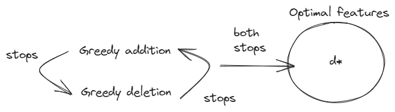
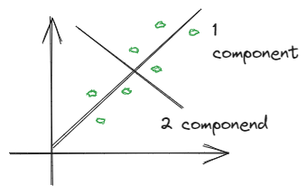
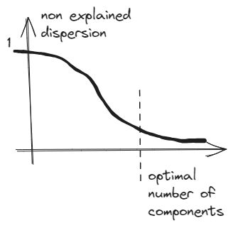
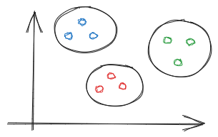

## Methods of feature selection

1. Unifactor feature selection

Unifactor feature selection has disadvantages in case of multifactor dependencies of 

Example: XOR

2. Feature permutation

Permute all possible combination

Example: $(x_1,x_2,x_3)$

Cons: 
$2^d$ - combinations is computationally expensive

3. Greedy addition

$F_t$ - set of informative features on step t
Following properties:
1. $F0$ - empty set
2. Find feature $x_j$, which addition to $F_{t-1}$, gives the least error.
3. Stop if error has grown on step.

Complexity is tractable: 
$$
    \frac{d(d-1)}{2}
$$

4. Add-Del

After steps of greedy addition we do inverse greedy deletion of features.

We'll stop when deletion or addition doesn't bring better results

5. Normalization -> learn linear models -> weights. Clip top-k absolute values

## Dimension reduction

$$
x1, \dots, x_n \rightarrow y_1, \dots y_m
$$

Pros:
- noise reduction
- numerical complexity facilitation
- interpretability
- overfitting reduction 

Principle Component PCA

Train set $X_i \in \mathbf{R}^D$

Find linear subspace $\mathbf{L}=\{x\in \mathbf{R}^D| x= x_0 + \sum\limits_{j=1}^d e_jy_j\}$

Projections:
$y_j in \mathbf{R}$
Orthogonal basis:
$e_j in \mathbf{R^d}$

Covaration matrix:

$$
    \hat{\Sigma} = \frac{1}{n} \sum\limits_{i=1}^n (x_i - \bar{x})^T(x_i - \bar{x})
$$

$a$ - defines direction of max dispersion $\| a\|=1$

$a^Tx_i$ - projection on a

$\mathbf{D}(a^Tx_I)$ - dispersion by direction on $a$

Expression for $sigma_a^2$

$$
    \sigma_a^2 = \frac{1}{n} \sum\limits_{i=1}^n (a^tx_i - a^T\bar{x})^2=\
    \frac{1}{n} \sum_{i=1}^n a^T (x_i-\bar{x})^T (x_i - \bar{x}) a =\
    a^T \[ \frac{1}{n} \sum\limits_{i=1}^n (x_i - \bar{x})^T(x_i - \bar{x}) \]a = \
    a^t \hat{\Sigma} a
$$

Lemma: 

$$e_1$$ - eigenvector of $\hat{\Sigma}$ with $\lambda_1$ the largest eigenvalue of $\hat{\Sigma}$ 

$e_1$ projection: $x_i^' = x_i - e_1^T x_i e_1$

Lemma:

$e_k$ - eigenvector of $\hat{\Sigma}$ with eigenvalue $\lambda_k$ with k order in descent of eigenvalues

Total variance is sum of projection:

$$
    \mathbf{D}_xi = \mathbf{D}e_1x_i + \dots + \mathbf{D} e_{D} x_i 
$$

$$
    y_j = e_j^T (x-\bar{x}) \
    \hat{x} = x_0 + \sum_{j=1}^d 
$$

Classical visualization for dimension reduction techniques

## Clusterization

Type of learning without teacher

$x_1, \dots, x_n$ - objects

Problem formulation:
- no goal variables
- study nature of data

Example:
Color images based on distance similarity
\\

Pros:
- can be downstream task
- information reduction -> task simplification

$x_1, \dots, x_n$ - training set. $K$ - number of clusters. Usually is hyperparameter.

Types of clustering:
- soft: element can belong to several clusters with some probability

$x_i \sim {p_1, \dots, \p_n}, \sum p_i =1$ 

- hard: element can belong only to one class

$x_i \sim K$

Algorithm examples:
- K-means is hard 
- C-means (type of K-means) is soft
- Agglomerative is hard
- DBScan is hard

### Clusterization metrics:

- $\rho(x_1,x_2)$ - distance between points $x_1,x_2$

$f$ maps point and label cluster
1. Mean inner cluster distance
$$
    F_0(f) = \frac{\sum_i=1 I\{f(x_i)=f(x_j)\} \rho(x_i,x_j)}{\sum_i=1 I\{f(x_i)=f(x_j)\}}
$$

2. Outerclass distance

$$
    F_1(f) = \frac{\sum_i=1 I\{f(x_i) \ne f(x_j)\} \rho(x_i,x_j)}{\sum_i=1 I\{f(x_i)\ne f(x_j)\}}
$$

Metrics can be easily cheated. Example:
Innerclass distance can be optimized to zero via increasing number of clusters

Silhouette:
$$
    \frac{F_0(f)}{F_1(f)} \rightarrow \min_{f}
$$

3. Mean distance to center of cluster

$$
    \sum\limits_{k=1}^K \sum\limits{i=1}^n I{f(x_i)=k} \rho(x,\mu_k)
$$

$mu_k$ - mean among x with k label

$mu_k = \frac{1}{\sum\limits_{i=1}^n I{f(x_i)=k}}{\sum\limits_{i=1}^n I{f(x_i)=k} x_i}$

## Clusterization methods comparison

### K-means

Works iteratively.

Random initialization of cluster centers.

1. All points are labeled according to nearest center
2. Move center to nearest points

Works well with good in separate spherical clouds

$D \rightarrow d$,

