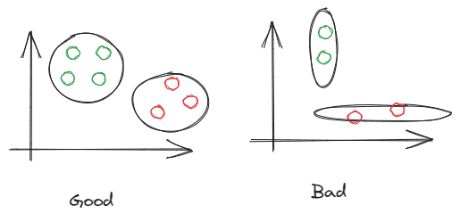

# Clustering (sequel)

Set $X_1,\dots,X_n$ should be clustered to $K$ groups

## K-means

Similarity is defined by distance
$$
    \rho(x,z)= \| x -z  \|^2 
$$

Function $f: x \rightarrow \{1,\dots, K\}$ defines clustering
$$

$$

Algorithm:

1. Define initial approximation of cluster centers $\mu_1, \dots, \mu_n$. $\mu$ can be treated as hyperparameters of method.
    Look for K-means++ for some heuristic approximations. 
2. Select clusters $f(x_i) = \argmin_K \| x_i - \mu_k \|^2$
3. New cluster center is defined by $\mu_k = \frac{\sum_j I\{f(x_i)=k\}x_i}{\sum_j I\{f(x_i)=k\}}$
4. Run until convergence

Best practice:
- be attentive to centroids inicialization

## DBSCAN 

Acronym means "Density based"

2 hyperparameter: $\varepsilon, m$ 

Recall $\varepsilon$ neighborhood

$$
    U_\varepsilon(x) = \{x' \in X: \rho(x,x') \le \varepsilon\}
$$

Object types:
1. Main with criterion: power of point neighborhood $|U_\varepsilon(x)|$ should be more than $m$ 
2. Border - not main, but lie in neighborhood of main $|U_\varepsilon(x)|$ 
3. Noisy - others

Pros:
- clusters can have more complex shape
- outlier detection
- fast $O(n^2)$ and one iteration
  
Cons:
- instability for near clusters
- hyperparameters for one cluster can be bad for others
- hyperparameters are hard to select

## Agglomerative clustering

1. Define $\rho(x,z)$
2. Structure hierarchy of nested clusters

Algorithm:

1. Every object is cluster
2. Merge two least distance objects. Mean of clustered is defined like mean. 
3. Repeat until convergenes.  Note that we calculating mean we should weight with respect to number of points in cluster 

# AB-testing

Types of samples
1. Independent samples
2. Dependent samples

\* Type 2 methods can be used for 1. The reverse is not true

$x_1, \dots, x_n$

$\mathbb{P}_1, \mathbb{P}_2$ - family of distribution with certain interesting for investigation quality 

$H_0: P \in \mathbf{P}_1 \ vs \ H1:s$

$x_1, \dots, x_n \in \varkappa$

$s \in \varkappa: P(x\in S) \le \alpha, \forall P \in P_1$ - critical value of $\alpha$ 

$$
H_0\ is\ rejected \rightleftarrows x \in S
$$

Case

X_i 

$H_0: p_1=p_2  vs H_1: p_2 > p_1$

Solution:

Define

$\hat{p}_1 = \bar{x}, \hat{p}_2 = \bar{y}$

Dispersion estimation:

$$
    \hat{\sigma} = \sqrt{\frac{\hat{p}_1(1-\hat{p}_1)}{n}+\frac{\hat{p}_2(1-\hat{p}_2)}{m}}
$$

If $H_0$, use Wald Criterion: 
$$
    W(X,Y) = \frac{\hat{p_2} -\hat{p_1}}{\hat{\sigma}} \sim^d \mathbb{N}(0,1)
$$

$S = \{W(X,Y) > z_{1-\alpha}\}$

Absolute t-test:

$$
    \frac{\hat{X}-\hat{Y}}{\hat{\sigma}} \rightarrow \mathbb{N}(0,1)
$$

If sets are small use $T_{n+m-2}$ with student quantiles $t_{1-\alpha}$.

That helps not to underestimate risks.

\* confidence intervals is easier for interpretation

$$
    \left|\frac{\bar{x}-\bar{y}}{\sigma}\right| > t_{1-\frac{\alpha}{2}}
$$ 

$$
    (\bar{x}-\bar{y} - t_{1-\frac{\alpha}{2}} \sigma,\bar{x}-\bar{y} + t_{1-\frac{\alpha}{2}} \sigma )
$$

## Relative T-test

$$
    R = \frac{\bar{x}-\bar{y}}{\bar{y}}
$$

$$
a_R = ER \approx \frac{a_1 - a_2}{a_2} \\
\sigma_R^2 = DR \approx \frac{\sigma_1^2}{a^2}
$$

