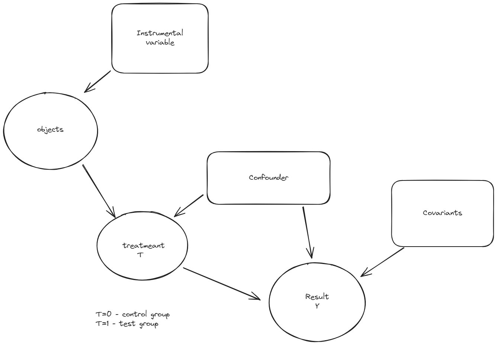

## Linear regression

$$
    y=y(x)= \theta_1 x_1 + \dots +  \theta_d x_d
$$

Assumptiton that:

$$
    Y_i = y(x_i) + \varepsilon_i
$$

$\varepsilon_i$ - stochastic error

$x_1,\dots,x_d$ - features 
$\mathbf{\theta}=$

Optimal constraint:
$$

$$

Optimal solution:

$$
    \hat{\theta} = (X^TX)^{-1}X^TY \\
    \hat{y} = x^Y \hat{\theta}
$$

Assumptions:
1. $\mathrm{E}\varepsilon=0 \rightarrow$ 
   - $\hat{\theta}$ - unbiased $\theta$, 
   - $\hat{y}$ - unbiased $y(Xs)$
2. $\mathrm{E}\varepsilon=0, \mathrm{D} \varepsilon = \sigma^2I \rightarrow$ 
    - $D\hat{\theta}=\sigma^2 (X^TX)^{-1}$
    - $D\hat{y}=\sigma^2 x^T(X^TX)^{-1}$
    - $\hat{\sigma}^2 = \frac{1}{n-d}\|Y-X\hat{\theta}\|^2_2$, n- number of samples, d- dimension of feature space
3. $\varepsilon \sim \mathrm{N}(0,\sigma^2I)$ - sampled from normal distributions $\rightarrow$

$$
    H_0: \theta_j = 0 \text{ vs } H_1: \theta_j \ne
0$$

t-test

$$
    T_j(X,Y) = \frac{\hat{\theta}_j}{\hat{\sigma}\sqrt{(X^TX)^{-1}}} \sim^{H_0} T_{n-d}
$$

For $H1$: $\theta_j \ne 0$: 
$$
    \{|T_j(X,Y)| > T_{n-d,\frac{1-\alpha}{2}}\}
$$ 

Homoscedasticity:
$$
    D\varepsilon = \sigma^2 I_n
$$
Heteroscedasticity
$$
    D\varepsilon = \sigma^2 I_n
$$
Examples:
1. Correlation between samples
2. Diag $\mathrm{D}\varepsilon =diag(\sigma_1^2,\dots,\sigma_d^2)$
3. Dependance on feature space $D\varepsilon=(\sigma(x))^2I_n$

$$
    H = X(X^TX)^{-1}X^T
$$

$\hat{\varepsilon}_i=e_i=Y_I-\hat{Y}_i$

$De_i \ne \sigma^2$

$e=Y-\hat{Y}=(I_n-H)Y$

So
$\hat{Y}=HY, Y=I_nY$

$De=(I_n-H)DY(I_n-H)^T=\sigma^2(I_n-H)$

Note that: $H^2=H$

$$
    \hat{e}_i= \frac{e_i}{\sqrt{\hat{D}e}}=\frac{e_i}{\frac{\|Y-X\hat{\theta}\|}{n-d}(1-H_{ii})}
$$

So that:

$$
    D \hat{e}_i = \sigma^2
$$

For $\mathrm{E}\varepsilon=0, D\varepsilon=V$:

$$
    \Sigma = \mathrm{D}{\hat{\theta}}= (X^TX)^{-1}X^TVX(X^TX)^{-1}
$$

- for V=\sigma^2I_n
$$
    \Sigma = \sigma^2(X^TX)^{-1}= \\
    \hat{\Sigma}= \hat{\sigma}^2(X^TX)^{-1}
$$
- for $V=\text{diag}{\sigma^2_1,\dots,\sigma^2_d }$

White (HCE estimate):

$$
    \hat{\Sigma}=(X_TX)^{-1}X^Tdiag(\hat{\sigma}^2_1,\dots\hat{\sigma}^2_d)X(X^TX)^{-1}
$$

HCO: $\hat{\sigma}^2_i = \hat{e_i}^2$
MacKinonWhite:\
- $HC_1: \frac{n}{n-d}\hat{e}_i^2$
- $HC_2: \frac{n}{n-d}\hat{e}_i^2$
- $HC_3: \frac{n}{n-d}\hat{e}_i^2$

Correlation $\ne$ Causality 

## Causal Inference

$$
Y = \begin{cases}
    C_0,T=0 \\
    C_1, T=1 
\end{cases}
$$

$ATE=\mathrm{E}(C_1-C_0)$ - average treatmeant effect

$ATT=\mathrm{E}(C_1-C_0|T=1)$ - test on equal groups 

Associativity: 

$\alpha=\mathrm{E}(Y|T=1) - \mathrm{E}(Y|T=0)$

If groups are chosen randomly

$\alpha = ATT=ATE$

Propensity score

Estimate of probability:

$$
P(x)=P(T=1|X=x)
$$

