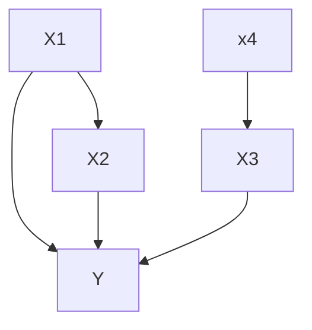
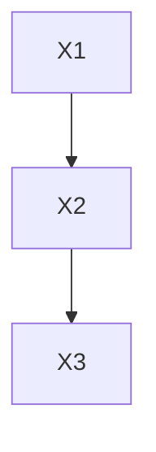
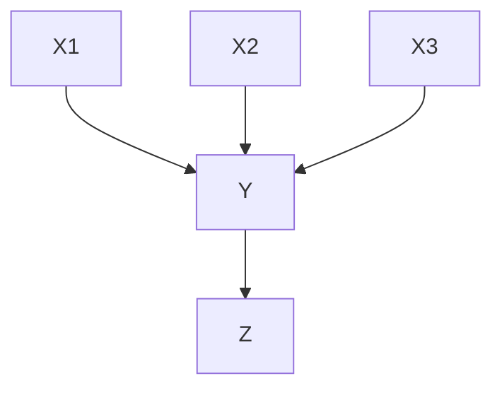
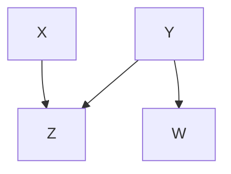
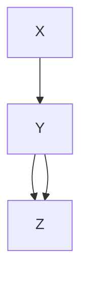
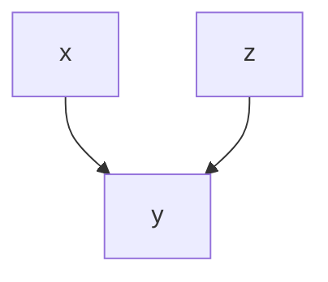
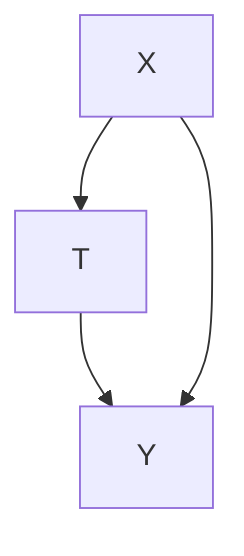
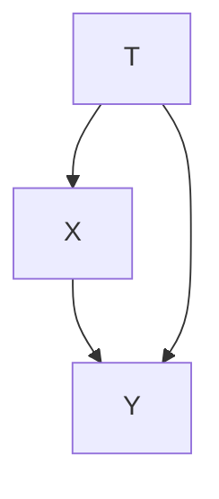

Graph is defined via symbolic formula
$$
    G = (V,E)
$$
V - notes vertexes, E - edges.
$$
    V=(x_1,\dots,x_d)
$$
,where $V$ is set of features.

Graph objects objects conditioning on feature.

Definition: 
Distribution $P$ of set of random variables $V$ with density $p(v)$ named markovian distribution for graph $G$ if 
$$
    p(v) = \prod\limits_{j=1}^d P(x_j|\pi_j)
$$

where $x_1, \dots, x_d$ -values and $\pi_j$ - parent $x_j$

1. Markovian chain

$$
    p(x) = p(x1) p(x_2|X_1=x_1) p(x_3|X_2=x_2) \dots p(x_n|X_{n-1}=x_{n-1})
$$

Examples:
1. Lecture attendance 

Y - is number of people who attendant lection 
Z - number of people who marked attendance in note

$$
    p(x_1,x_2,x_3,y,z) = p(x_1) p(x_2) p(x_3) p(y|X_1=x_1,X_2=x_2,X_3=x3) p(z|y)
$$

X - obesity
Y - smoking
Z - cardio problems
W - cough

Probability of graph:

$$
    p(x) p(y) p(w|Y=y)P(z|X=x,Y=y)
$$

Theory:

Likelihood of model graph on training set with n objects and d features

$$
    L_v = \prod_{i=1}\prod_{i=1} P_{\theta_j} (X_{ij} | \pi_{ij})
$$

V - vertexes 

$p_{\theta_j}(x_j|\pi_j)$ - is some model
- for categorical - density table
- for float - linear regresion. But it's not restricted. You can try neural net

Intervention

estimeate of reasoning via graph manipulation.

method for estimation via graph 

Recall

$$
    ATE=E(C_1-C_0)
$$

$$
    p(x,y,z) = p(z) p(x|z) p(y|x,z)
$$

How to estimate effect:
$$
    P(Y=y|X=x) = \frac{P(X=x,Y=y)}{P(X=x)}  
    = \frac{\int_z p(x,y,z)}{p(X=x)}
$$

For certain case:

$$
    P(Y=y|X=x) = \int_z p(z) p(y|x,z)
$$

### Intervention

We change graph model by fixing $X = x$

$$
    p^*(y,z) = p(z)p(y|x,z)
$$

So 
$$
    p(Y=y|X=x) = \int p(z)p(y|x,z) dz
$$

Algorithm $(X \rightarrow Y)$
1. Create $G^*$ from $G$ by removing edges influencing node X.
2. creation of new distribution $P^*$ via analyzing new graph

|| Placebo | Treatment |
|----|----------|--|
|Low pressure|$\frac{81}{87}=93\%$|$\frac{234}{270}=87\%$|
|High pressure|$\frac{192}{263}=73\%$|$\frac{55}{80}=69\%$|
|All|$\frac{273}{350}=78\%$|$\frac{289}{350}=83\%$|

1. Pressure was measured before medicine and consequent on treatment.

Intervention $T =t$, $t\in \{0,1\}$:

1. $T=1$, $y=c_1$

$$
    \mathrm{E}C_1 =\mathrm{E}^*_{T=1}y=\mathrm{E}(Y|T=1) 
$$
2.$T=1$, $y=c_0$

$$
    \mathrm{E}C_0 = \mathrm{E}(Y|T=0) 
$$

$$
    ATE = \mathrm{E}(C_1-C_0) = \mathrm{E}(Y|T=1) - \mathrm{E}(Y|T=0) = P(Y|T=1) - P(Y|T=0)
$$

$$
    p^*(x,y)= p(x)p(y|x,t)
$$

$$
    p(Y=y|T=t) = \sum\limits_x p(x) p(y|x,t)
$$

$$
    p(Y=1|T=1) = \sum\limits_{x=0}^1 P(X=x)P(Y=1|X=x,T=1)
$$

2. Now treatmeant affect pressure

$$
    p^*(x,y)= p(x|t)p(y|x,t)
$$

$$
    p(Y=y|T=t) = \sum_x p(x|t) p(y|x,t)
$$

$$
    p(y=1|T=1) = \sum\limits_{x=0}^1 P(x=x|T=1) P(y=1|X=x,T=1)
$$

$DoWhy$ - microsoft library for casual inference