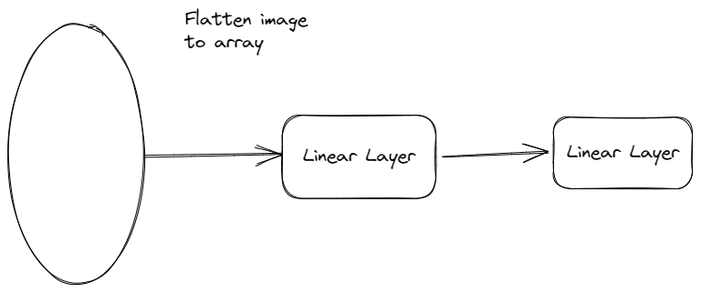
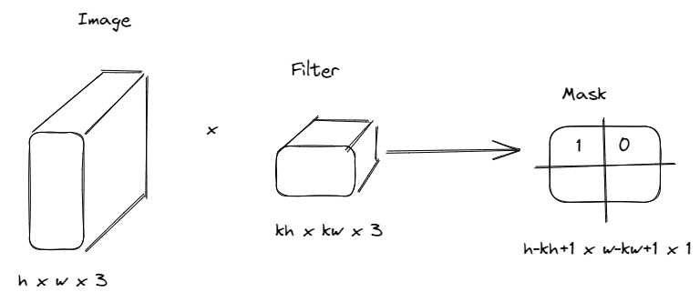
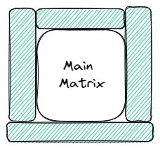
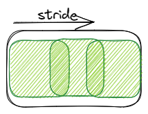
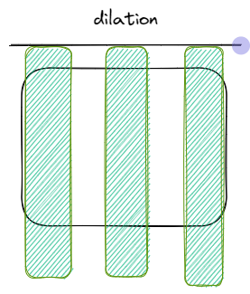

# Optimization methods

$\mathbf{L}(x) \rightarrow min$

## Stochastic gradient descent (SGD)
$$
x_{t+1} = x_t - \eta \nabla L(x_t)  
$$

$\eta$ - learning rate

## SGD+Momentum

$$
    x_{t+1}= x_t + \mathbf{v}_t \\
    v_t = \mu v_{t-1} - \eta \nabla L(x_t)
$$

$\mu$ - decay rate

## AdaGrad 

$$
    x_{t+1} = x_t - \frac{\eta}{\sqrt{g_t+\epsilon}} \cdot \nabla L(x_t) \\
    g_t = g_{t-1} + \nabla L(x_t) \cdot \nabla 
$$

$g_t$ - monotonically increases every step

## RMSProp - AdaGrad + exponential decay

$$
x_{t+1} = x_t - \frac{\eta}{\sqrt{g_t+\epsilon}} \cdot \nabla L(x_t) \\
    g_t = \mu g_{t-1} + (1-\mu)\nabla L(x_t) \cdot \nabla  
$$

## Adam - RMSProp + Momentum

$$
x_{t+1} = x_t - \frac{\eta}{\frac{\sqrt{g_t+\epsilon}}{1-\mu^t}} \cdot \frac{v_{t+1}}{1-\beta^t} \\
    v_{t+1} = \beta v_t + (1-\beta) \nabla L(x_t) \\
    g_t = \mu g_{t-1} + (1-\mu)\nabla L(x_t) \cdot \nabla  L(x_t)
$$

$\eta = 0.001$

Learning Rate can be modified during training

## Batch Norm

Covariant drift (Ковариционный сдвиг)

Batch samples can differ very much during training.
This can result to variance over gradients to net parameters. Which leads to slower convergence.
 
We can advance this challange by using batch normalization.

Difference between batches is called covariant drift
Drift in net parameters is called inner covariant drift

Another solutions:
- decreasing learning rate
- making bigger

Idea:

After layer we append Batch Norm layer (torch.BatchNorm)
$$
(x_{i_1},...,x_{i_b})
$$

## Convolutional nets

Image is tensor with shape:

$$
    H \times W \times 3 
$$
 
$RGB \in [0,255]$

X - image population 

Y - set of classes

We are looking for classification function:
$$
f: X -> Y
$$

It can be done with simple MLP

But it doesn't get relative position information

## 2D convolution

Image
$$
\begin{bmatrix}
    1 & -1 & 1 & 0\\
    1 & 1 & 0 & 1 \\
    1 & 0 & 1 & 0 \\
    0 & 1 & 0 & 0 \\
\end{bmatrix} 
$$

Filter

$$
\begin{bmatrix}
    1 & -1 & 1\\
    -1 & 1 & -1 \\
    1 & -1 & 1 \\
\end{bmatrix} 
$$

Mask. Value show similarity to filter

$$
\begin{bmatrix}
    2 & -3 \\
    -3 & 4 \\
\end{bmatrix} 
$$

Weights of filters are learned through model training. Size of filter is hyperparameter

Weights in filter is defined 

Number filters result in numbers of masks

### Convolution parameters

Convolution can be customized for purposes of optimization 

#### Padding

Adds additional zeros to left and right of matrix. That helps to apply filter to sides of image

#### Stride 

Defines step of convolution

#### Dilation    

Allows to skip few rows

### Poooling

Helps to remove dimension of tensor

Like convolution, but rule based.
Doesn't learn weights so it's faster to apply

Types:
- max
- average
- sum

Image
$$
\begin{bmatrix}
    12 & 21 & 9 & 10\\
    4 & 5 & 0 & 15 \\
    1 & 0 & 10 & 0 \\
    0 & 8 & 0 & 0 \\
\end{bmatrix} 
$$

Filter as 2dMaxPooling 2x2 with stride 2

$$
\begin{bmatrix}
    max() & max() \\
    max() & max()  \\
\end{bmatrix} 
$$

Mask:

$$
\begin{bmatrix}
    21 & 15 \\
    8 & 10  \\
\end{bmatrix} 
$$

