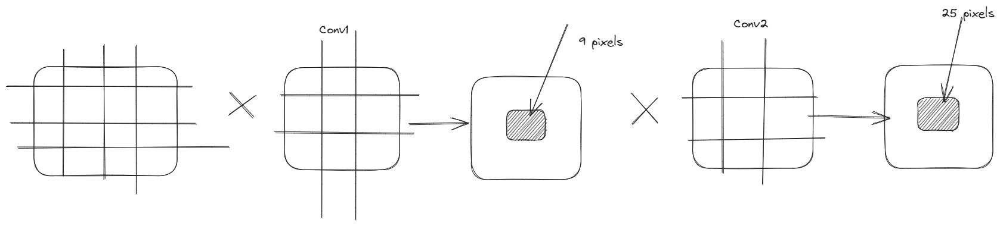
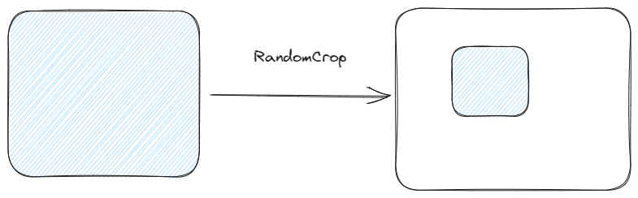
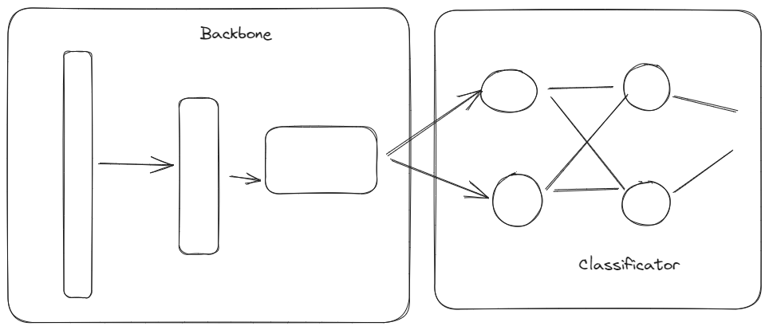
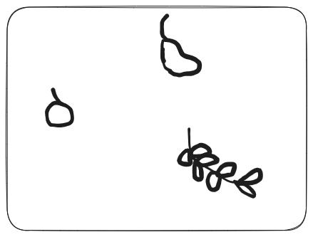
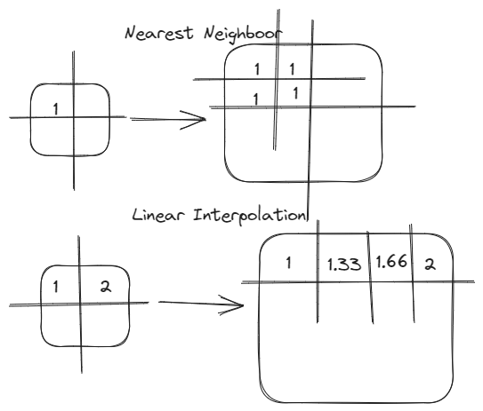
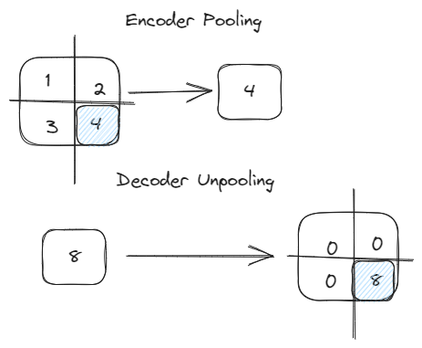

# CNN Recap

## Receptive field

- field of view of concrete pixel

Networks with more layers have 

Stride helps to work with noisy images

## Augmentation

Augmentation helps to overcome overfitting by modification of input data.

Most common:
- blur
- rotation
- random cropping
- color jittering

## Transfer Learning 

We can use pretrained net for our tasks. Idea is that nets are 

Two main strategies:
- feature-extractor. Replace classifcator from net and put classifier for your task
- fine-tuning.

### Feature-extractor 

It can be done in three simple steps:
- We take weights of prepared network like ResNet
- Then we remove classification layer from image
- We add trainable classifier for our purpose.

BathcNorm2d and Dropouts in "freezed" layersare placed in eval  

### Fine-tunning

Fine-tuning is same but we train feature-extractor for our network. We freeze only first few layers.

# Image Segmentation

Point each pixel probability of being part of image

X - image space ()

Y - number of classes

$\hat{X}$ - image space, where each pixel has probability of being class from Y.

$$
    f: X \rightarrow \hat{X}
$$

Result in field of computer vision is called segmentation mask/

## Encoder-Decoder architecture

Basically, encoder is feature extractor which forms vector informative representation of image

Result is $h \times n \times d$

$d$ is often very big for leaning segmentation of different forms

Then we want our decoder to form mask from vector representation.

$H \times W \times K$

## Decoder can use several techniques

- Interpolation

- Reverse Pooling
We rember which pixel was used in pooling. Then we use that information for unpooling

Pooling and unpooling are connected via code 

## Transpose Convolution

<table style="width:100%; table-layout:fixed;">
  <tr>
    <td></td>
    <td></td>
    <td></td>
  </tr>
  <tr>
    <td>padding = 0; stride = 1; output_padding=0</td>
    <td>padding = 1; stride = 1; output_padding=0</td>
    <td>padding = 2; stride = 1; output_padding=0</td>
  </tr>
  <tr>
    <td></td>
    <td></td>
    <td></td>
  </tr>
  <tr>
    <td>padding = 0; stride = 2; output_padding=0</td>
    <td>padding = 1; stride = 2; output_padding=0</td>
    <td>padding = 1; stride = 2; output_padding=1</td>
  </tr>
</table>

