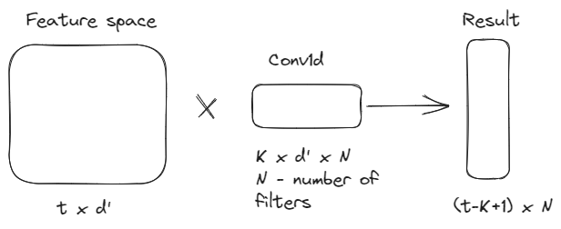
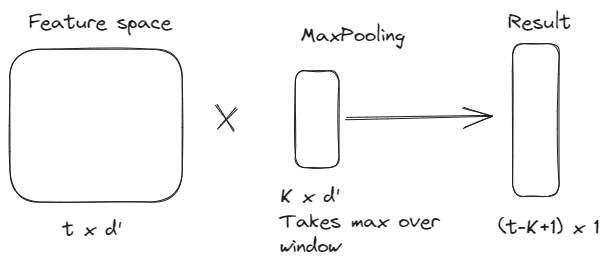

## Semantic segmentation

Can be performed by UNet 

## Intersection over union 

Fraction of Area of overlap to Area of Union
 
$$
    IoU = \frac{ A \cap B}{A \cup B}
$$

* sequence of vectors $x_1 \dots, x_t$ - векторы размерности $d'$

$$
\begin{bmatrix}
           x_{1}^0 \\
           \vdots \\
           x_{n}^0
         \end{bmatrix}

\rightarrow 

\begin{bmatrix}
           x_{1}^1 \\
           \vdots \\
           x_{n}^1
         \end{bmatrix}

\rightarrow
\dots

\begin{bmatrix}
           x_{1}^t \\
           \vdots \\
           x_{n}^t
         \end{bmatrix}

\rightarrow
$$

Output is vector $e \in \mathbf{R}^n$

Horizontal element can be obtained from different domen knowledges

Vertical element has an idea of evolution over continuation over fixed  dimension for all horizontal elements, for example, time

$$
    \begin{bmatrix}
            x_{11}^t \dots x_{d1}\\
            \vdots \\
            x_{n}^t \dots x_{dt} \\
    \end{bmatrix}
$$

## One dimension convolution

Conv1d is defined by time window and dimension of  

1D-Pooling

Cons of method
- we need to apply a lot of convolution to redact long time series
- we need to use different amount of convolutions for time series of different size

For task of prediction next vector we'll need to learn $d \cdot (d'K+1)$ amount of parameters
- d - dimension after applying the convolution
- d' - dimension of feature space

## Recurrent Neural Network (RNN)

1. Vanila RNN $\rightarrow$ RNN

$$
\begin{pmatrix}
  \vdots 
\end{pmatrix} 
\rightarrow
\begin{pmatrix}
  \vdots 
\end{pmatrix} 
$$

Hidden states are processed with tanh

$$
    h_t = tanh(h_{t-1}W_h+x_tW_x)
$$

$W_h, W_x$ - trainable parameters of RNN

Hidden states can be trained for prediction for part of nouns or prediction of $X_T$

$
    h_t \sim x_1,x_2, \dots, x_T
$

## Gradient vanishing or explosion

If norm of $\| w \|$ < 1 gradient will vanish over network.
$\| w \|$ > 1 gradient will explode network.

## LSTM (Long Short Term Memory)

Block $A$ becomes vivid 

1) Forget Gate

Decide modification of $c_{t-1}$ 

2-3) Input Gate

$[h_{t-1},x_t]$ - concatenation of vectors $h_{t-1}$ and $x_t$

$$
    i_t = \sigma(W_i[h_{t-1},x_t]+b_t)
$$

$$
    \hat{c}_t = tanh(W_c[h_t])
$$

$$
    i_t \cdot \hat{c}_t 
$$

4) Output gate

$$
    o_t = \sigma(W_o[h_{t-1},x_t]+b_t)
$$

$$
    h_t = o_t * tanh(c_T)
$$

New hidden state:
$$
    h_t = o_t \cdot tang(f_t c_{t-1} + i_t \hat{c_t})
$$

New cell:
$$
    c_t = f_t c_t + i_t \hat{c_t}
$$

Gradient of RNN:

$$
    h_t = tanh(h_{t-1}) \\

    \frac{\partial h_i}{\partial h_{t-1}} = tanh(h_{i-1}w_h+x_i w_x) w_h

    \frac{\partial h_t}{\partial h_k} = \prod\limits_{i=k+1}^t tanh(\dots)w_h
$$

LSTM:

$$
    c_t = f_t c_{t-1}+i_t \hat{c_t} \\
    \frac{\partial{c_t}}{\partial c_{t-1}} = f_t +c_{t-1} \frac{\partial f_t}{\partial c_{t-1}} + \hat{c_t} \frac{\partial i_t}{\partial c_{t-1}} + i_t \frac{\partial \hat{c_t}}{\partial c_{t-1}}
$$

For defining part of speech we will use hidden state. Yet cell state will probably be ok, too :)

3. GRU (Gated Recurrent Unit)

Reduces number of trainable parameters and computational costs

Rule of thumb

- GRU is better for small dataset
- LSTM is better for big datasets