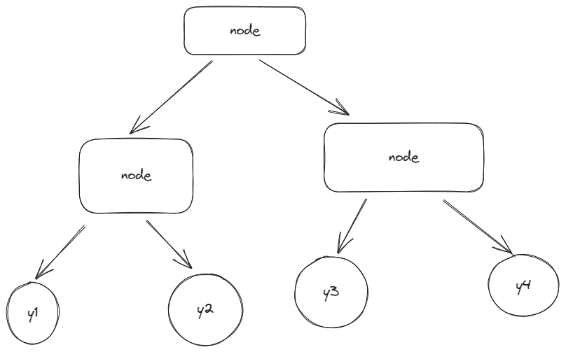
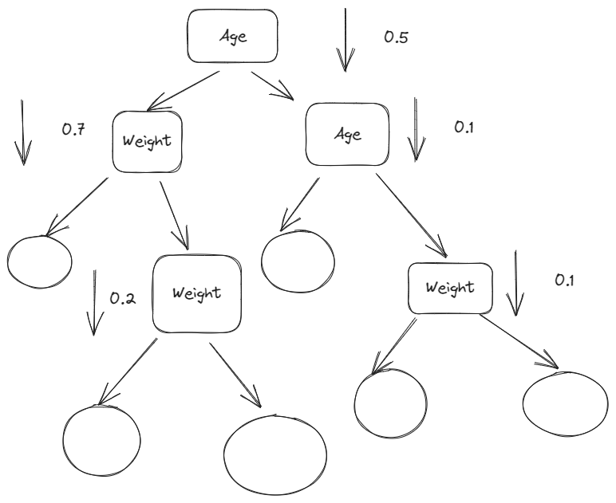
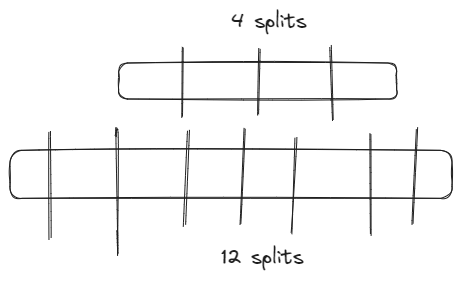

## Bagging and random forest

Solving tree is modeled by graph directed graph with nodes and edges no more than 2

Every node has an indicator

$$
    I\{x^{(j)}\} <t 
$$

Input vector:
$$
    X = \begin{pmatrix}
        x^{(1)} \\
        \vdots \\
        x^{(n)}
    \end{pmatrix}
$$

j,t of node is concluded by minimazation of:

$$
    j,t = argmin_{j,t} Q = \frac{|X_l|}{|X_m|} H(X_L) + \frac{|X_r|}{|X_m|}H(X_r)
$$
where
- $|X_l|$ - is volume of samples directed to left leaf
- $|X_r|$ - is volume of samples directed to right leaf
-  $|X_m|$ - is volume of input to node
-  H - is minimzation 

## Random forest
assemble of solving trees
$$
    f = \frac{1}{T} \sum_{t=1}^T b_t
$$
where $b_t$ - solving tree, which is 
- trained on bootstrapped dataset 
- trained on random subset of feature space

## Bagging

$\hat{y}(x)$ predicts goal function $f(x,\varepsilon)$

$$
    L(\hat{y(x)},y)=(\hat{y}-y)^2
$$

On concrete sample (X,y) - concrete sample

$$
    \mathbf{E}L(\hat{y}(x),y) = \mathbf{D}\hat{y}(x) + (\mathbf{E}(\hat{y}(x)-f(x,\varepsilon)))^2 + \mathbf{D}f(x,\varepsilon)
$$

- $\mathbf{D}\hat{y}(x)$  - variance of model prediction
- $(\mathbf{E}(\hat{y}(x)-f(x,\varepsilon)))^2$ - bias between expected value of model and true function
- $\mathbf{D}f(x,\varepsilon)$ -variance of goal function

Let's study the case of models from one class. They can we can have differenet parameters, yet structure and learning must be equal:

$$
    Bias^2 = (\mathbf{E}(\hat{y}(x)-f(x,\varepsilon)))^2 = (E(\hat{y_1(x)})-f(x,\varepsilon))^2
$$

$$
    Variance = D(\hat{y}(x))=\frac{1}{T} D(\hat{y_1}(x)) + \frac{T-1}{T} cov(y1,y2)
$$

We should select models with low covariance between each other 

Bagging ensemble of models which are learned on boostsraped dataset

## Random forest

In-depth trees
- overfits -> low bias
- variance -> high. Because trees are sensitive to datasets
- low correlation between

Random forest as ensemble of in-depth trees 

In result we will have:
- low bias 
- low correlation -> low variance with tree stacking  

## Practical recommnedations  

### Classification

Subset of features: $d_o = \sqrt{d}$

Every leaf have one element

### Regression

Subset of features: $d_o = \frac{d}{3}$

Every leaf have around 5 elements

## Interpretation. Feature importance 

Loss of node:
$$
    Q(x_m,j,t) = \frac{|X_l|}{|X_m|} H(X_L) + \frac{|X_r|}{|X_m|}H(X_r)
$$

Deviation of bringing new node:

$$
    \Delta Q = H(X_m) - \frac{|X_l|}{|X_m|} H(X_L) - \frac{|X_r|}{|X_m|}H(X_r)
$$
It was 

Deviation of mistake on in node m on feature j:

$$
    \Delta I_j^m = \frac{|X_m|}{|X|}H(X_m) - \frac{|X_l|}{|X|} H(X_L) - \frac{|X_r|}{|X|}H(X_r)
$$

Feature importance of j:

$$
    \Delta I_j = \sum_m \Delta I_j^{m}
$$

H - is actually normalized too:

$$
H= min \frac{1}{|X_m|} \sum_{X_i \in X_m} (y_i - \hat{y}(x_i))^2
$$

Illustrating by age and weight

Weight is more important in that example

Importance of feature:
$$
    \Delta \hat{I_j} = \frac{\delta I_j}{\sum_j \Delta  I_j} = MDI
$$

MDI - Mean Decrease in Impurity

Critiques: 
- MDI works bad with categorical features.High number of categories will result in higffh probability of split despite it's quality

Feature with 12 splits will have higher probability of splitting.

