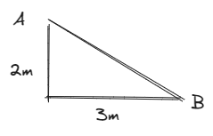
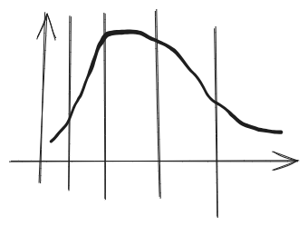
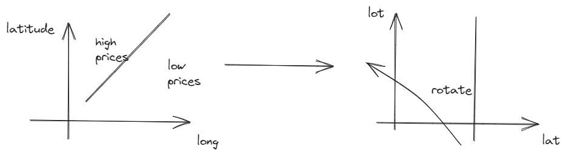
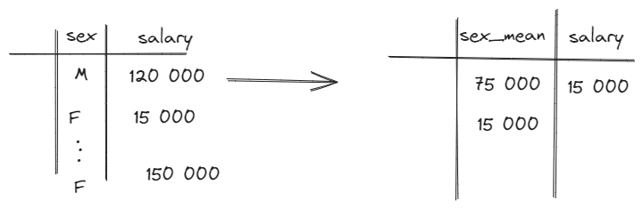
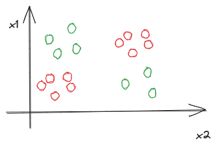

# Work with features

Numerical

Work with outliers

1. Ranks

train:

$$
    X_1, \dots, X_n \rightarrow \mathbf{R}_1, \dots,\mathbf{R}_1
$$

Ranks is obtained from sorting input X it has following qualitites:

Rang(X_max) = 1
Rang(x_min)= n

Example:
- 1 2 3 4 -> 1 2.5 2.5 4

For test we have several strategies of ranking:
- rank which is closest
- medium rank of closest 

Example 

X_train : 1, 3, 4
R : 3 2 1

New \hat{X}

\closest -> 3 (closest is one with rank3) 

\mean -> 2.5 

\weighted mean 3 + 1 + 1 * 1/2

X_tr 1,4,5
R 3 2 1  

Weighted average -> 3*1 +2 * 1/2 =2

Have good qualities for 
- KNN
- Neural Nets
- Linear Models

2. Transformations

- logarithmic
$$
    \hat{x}=ln(x)
$$
- powering
$$
    \hat{x} = \sqrt{x}
$$
- box-cox

$$
\hat{X} = \begin{cases}
    \frac{x^\lambda -1 }{\lambda}, \lambda \ne 0 \\
    ln(X), \lambda = 0
\end{cases}
$$

- Standardatization
$$
    \hat{X} = \frac{X - \mu}{\sigma}
$$
$\mu$ - mean among training set, $\sigma$

- Feature generation

Examples:

$$

$$

- Quantization or binning 

We make categorical features from numerical by splitting distributions into histograms

Two strategies:
- Fixed-width binning. Equal length bins between min and max values
- Adaptive binning via quanitiles

## Date and time

- time from previous 
- sinus by time with period 

## Coordinates

- longitude
- latitude

1. Additional information about distance to important objects
2. Clusterization 
3. Coordinate rotation
4. Several rotation 

## Ordinal features (ordered)

A,B,C

A is better than B and C is better but we don't know how much. We define it by impact on our task

We do label encoding
$$
A -> 1 \\
B -> 2 \\
C -> 3
$$
## Categorical features

Sex, race, profession 

1) Label Encoding

- sklearn.preprocessing.LabelEncoder - alphabet
- pandas.factorize - ordered by frequency 

linear model work bad with it 

2) One hot encoding

- K-1 - new columns
- K - categorical features

Growth  dimensionality of feature space -> leads to poor performance of model like knn and 

3) Mean (Target)encoding

Replace category with statistics of target

Regression classiffication:
- min
- max 
- mean
- dispersion

Binary classification:
- target rate

Multilabel classification with T labels:
T columns

Each label has it own label and we write frequency of it's class

Minus:
- overfitting. Columns have target statistics
- interportability. Such features gain lots of feature importance because they have target statistics

## Scalability

Standartization

$$
    \frac{x_{ij}}
$$

Min-max normalization:

$$
    \frac{x_{ij} - \min\limits_i (x_{ij}) }{\max\limits_i(x_{ij})- \min\limits_i(x_{ij})}
$$

## Feature selection

$X_1, \dots, X_d$ 

$d$ features $\rightarrow$ $d_0$

###  Unifactor selection:

1. Measuring information
2. Then we select top d_0 informative features

Informative is measuring by:
- feature importance
- correlation
- quality of model learned only on one feature

Information

Permutation feature imp

$$
    model \rightarrow err_1
$$

$$
    \begin{cases}
        without permutation \rightarrow err_1 \\ 
        with permutation \rightarrow err_2 \\
    \end{cases}
$$

Importance is 
- use test data for importance

Minus 
- lot's of models and computation 
- overestimate importance of correlated. Correlated columns is proxy of permutated, so mistake won't be much 

b) Drop column feature imporance 

$model \rightarrow err_1$ 

$model drop first table \rightarrow err_2$  

Importance is err_2 - err_1

Plus:
- use test data for importance
- general for all models
- most consistent importance
Minus 
- lot's of models and computation 
- overestimate importance of correlated 

Unifcator not always good. 
Illustration proofs that x1 and x2 in unifactor prediction is useless, yet it's conjunction has absolute accuracy. 

